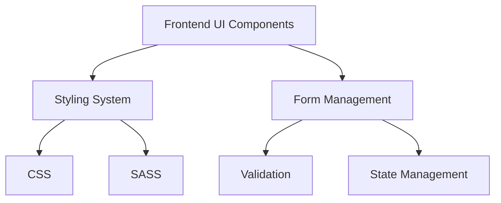

```mermaid
flowchart TD
    A["Frontend UI Components"] --> B["Styling System"]
    A --> C["Form Management"]
    B --> D["CSS"]
    B --> E["SASS"]
    C --> F["Validation"]
    C --> G["State Management"]
```